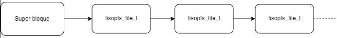
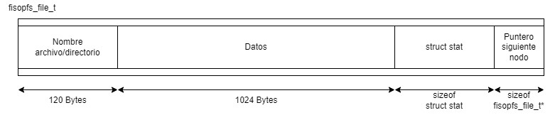
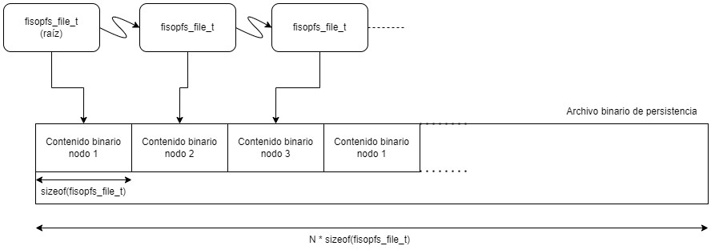
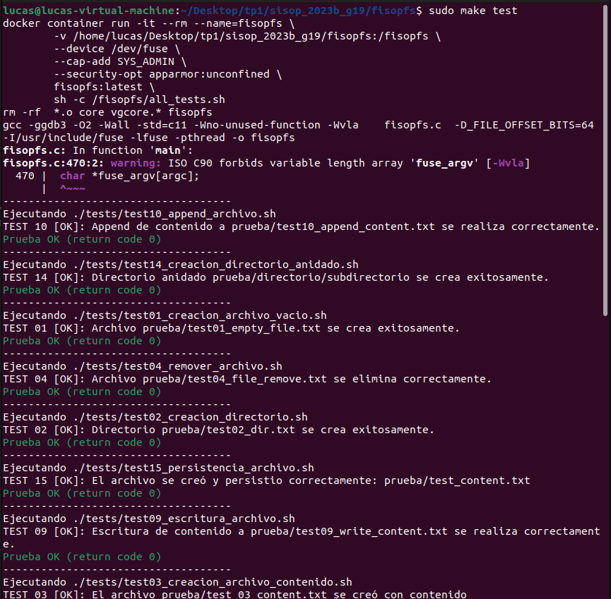
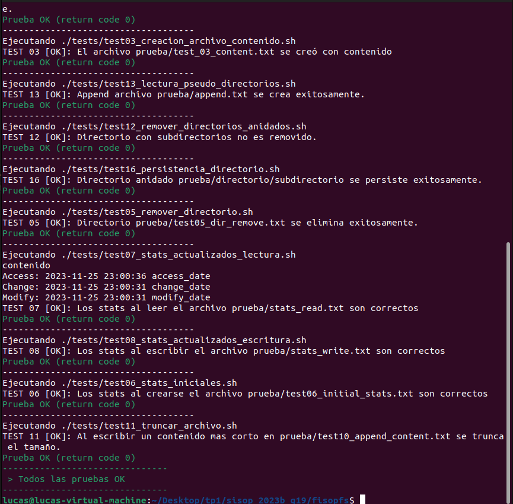

# fisop-fs

## Las estructuras en memoria que almacenarán los archivos, directorios y sus metadatos

Se posee un "superbloque" como dato principal que contiene información del contexto del filesystem, tales como el nombre del archivo de persistencia de este y el acceso al contenido del filesystem.

La estructura elemental para organizar el contenido del filesystem se puede representar como una lista enlazada donde cada nodo representa el archivo/directorio.

Diagrama estructural del filesystem

Cada nodo consiste en

- Los metadatos del archivo/directorio, embebiendo una copia del `struct stat` provisto.
- El contenido del archivo, si fuese de este tipo, mediante un arreglo de bytes de tamaño fijo
- El nombre del archivo/directorio en un arreglo de tamaño fijo.

Estructura del nodo

Al utilizar la lista enlazada simple se simplifica el remoción de datos y permite una cantidad libre de elementos (a diferencia de por ejemplo un arreglo estático de tamaño fijo). Por una cuestión de simplicidad tanto a la hora de instanciar como de serializar se admite que el contenido del archivo sea tamaño fijo conocido.

## Cómo el sistema de archivos encuentra un archivo específico dado un path

Cuando se necesita encontrar un archivo especifico se recorre dicha lista hasta encontrarlo. Una vez encontrado se tiene a disposición inmediata todos los datos necesarios (no es necesario ninguna redirección, búsqueda o acceso a memoria aleatoria).

## Todo tipo de estructuras auxiliares utilizadas

La principal estructura de datos consiste en una lista enlazada simple. Los datos del archivo (su nombre y contenido) son arreglos contiguos simples y los metadatos son una copia exacta del `struct stat`.

## El formato de serialización del sistema de archivos en disco

Dado que se optó por una lista enlazada con nodos de tamaño fijo, la serialización consiste en simplemente guardar secuencialmente los nodos. El orden de este guardado secuencial coincide con el orden de los elementos de la lista.

Diagrama de serializacion para persistencia del filesystem

Para inicializar el filesystem usando los datos persistidos intuitivamente se reconstruye una nueva lista donde cada nodo se levanta a medida que se leen bloques fijos del archivo de persistencia.

# Pruebas

Se genera un script principal para ejecutar todas las pruebas como una regla de `make test`. El script principal se encarga de aislar las distintas pruebas generando directorios auxiliares y limpiando archivos de persistencia (i.e. los archivos binarios serializados) para cada uno de los test. Las pruebas se ejecutan dentro del container para evitar problemas de repetibilidad.

Ejecucion de tests desde entorno local

Continuacion de ejecucion de tests

# Persistencia en archivo

Para que el guardado del file system se realice con un nombre en específico agregar los argumentos -n y a continuación el nombre del archivo de la siguiente forma `./fisopfs <mountpoint> -n <nombre-archivo>`. En caso de no especificarlo se crea un archivo con el nombre "fs".
